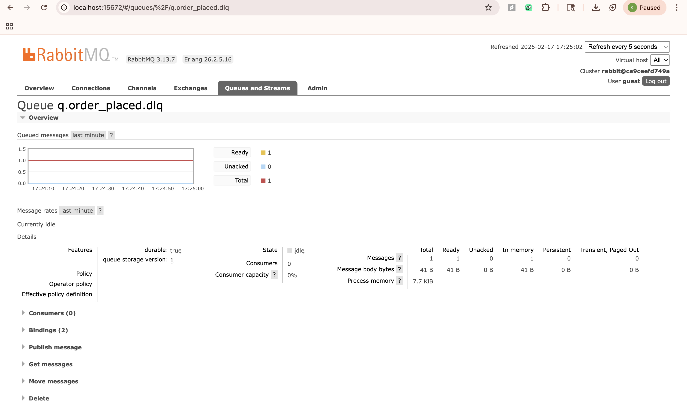
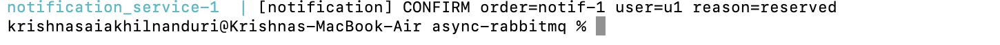

# CMPE 273 - Communication Models Lab Report

**Campus Food Ordering Workflow** implemented using three communication paradigms: Synchronous REST, Async Messaging (RabbitMQ), and Event Streaming (Kafka).

---

## Repository Structure

```
cmpe273-comm-models-lab/
├── sync-rest/              ← Part A: Synchronous REST
├── async-rabbitmq/         ← Part B: Async Messaging (RabbitMQ)
├── streaming-kafka/        ← Part C: Event Streaming (Kafka)
└── README.md               ← This file (root report)
```

Each part is fully self-contained with its own `docker-compose.yml`, services, tests, and documentation.

---

## Part A: Synchronous REST

**Directory:** [`sync-rest/`](sync-rest/)

### Architecture

```
Client → OrderService (POST /order)
              ├── → InventoryService (POST /reserve)   [synchronous]
              └── → NotificationService (POST /send)   [synchronous]
```

OrderService calls Inventory and Notification sequentially using blocking HTTP calls. If Inventory fails or times out, the order fails immediately with an error response.

### Services

| Service | Port | Role |
|---------|------|------|
| OrderService | 8081 | Accepts orders, orchestrates downstream calls |
| InventoryService | 8082 | Reserves stock, supports injected delay/failure |
| NotificationService | 8083 | Sends order confirmation |

### How to Build, Run & Test

#### Prerequisites

- Docker and Docker Compose installed and running
- Java 17+ on PATH (optional - if not available, the test script runs inside a Docker container automatically)

#### Step 1: Start All Services

```bash
cd sync-rest
docker compose up -d
```

Wait ~5 seconds for all three services to be ready. Verify with:

```bash
docker compose ps
```

#### Step 2: Run the Full Latency Test Suite

The test script automates all three tests (baseline, delay injection, failure injection) and generates both Markdown and HTML reports.

**Linux/macOS:**
```bash
./tests/run_latency_report.sh
```

**Windows (PowerShell):**
```powershell
.\tests\run_latency_report.ps1
```

The script performs these steps automatically:

1. **Baseline test (N=200):** Sends 200 POST requests to `http://localhost:8081/order` with a normal order payload and records latency percentiles.

2. **2-second delay injection:** Restarts InventoryService with `INVENTORY_DELAY_MS=2000` and OrderService with `INVENTORY_TIMEOUT_MS=3000`, then re-runs the 200-request test.

3. **Failure injection:** Restarts InventoryService with `INVENTORY_FAIL=true`, sends 3 POST requests, and captures HTTP status codes and error response bodies.

#### Step 3: View Results

Generated output files:

| File | Description |
|------|-------------|
| `latency_report.md` | Markdown report with all three test results |
| `latency_baseline.html` | Interactive Chart.js visualization for baseline |
| `latency_delay.html` | Interactive Chart.js visualization for delay test |
| `latency_failure.html` | Failure verification summary |
| `latency_index.html` | Index page linking all HTML reports |

Open `latency_index.html` in a browser for interactive charts, or read `latency_report.md` for the raw data.

#### Step 4: Stop Services

```bash
docker compose down
```

### Testing & Results

All latency test results are documented in two report files:

- **[Latency Table Summary](sync-rest/LATENCY_TABLE_SUMMARY.md)** - Analytical summary with reasoning for each test
- **[Latency Report (raw data)](sync-rest/latency_report.md)** - Machine-generated test output with exact numbers

HTML visualizations are also available:
- [`latency_baseline.html`](sync-rest/latency_baseline.html)
- [`latency_delay.html`](sync-rest/latency_delay.html)
- [`latency_failure.html`](sync-rest/latency_failure.html)
- [`latency_index.html`](sync-rest/latency_index.html)

#### Test 1: Baseline Latency (N=200 requests)

| Metric | Value |
|--------|-------|
| Avg latency | ~200 ms |
| p50 (median) | ~200 ms |
| p95 | ~400 ms |
| p99 | ~600 ms |

**Why:** Baseline latency reflects sequential processing: Inventory (~50-100ms) + Notification (~50-100ms) + network overhead. All on localhost so network cost is minimal.

#### Test 2: 2-Second Inventory Delay

| Metric | Baseline | With 2s Delay | Increase |
|--------|----------|---------------|----------|
| Avg latency | ~200ms | ~2200ms | **+2000ms** |
| p50 | ~200ms | ~2200ms | **+2000ms** |
| p95 | ~400ms | ~2400ms | **+2000ms** |
| p99 | ~600ms | ~2600ms | **+2000ms** |

**Why:** OrderService uses synchronous blocking calls (`.block()`). It waits for Inventory to complete before proceeding, so the 2s delay maps directly to a 2s increase in end-to-end latency. This demonstrates the **tight coupling** inherent in synchronous architectures.

#### Test 3: Inventory Failure Handling

| Request | Result | Verdict |
|---------|--------|---------|
| 1 | HTTP 502 | Pass |
| 2 | HTTP 502 | Pass |
| 3 | HTTP 502 | Pass |

Error response includes `"error": "DOWNSTREAM_ERROR"` with downstream status code. Service does not hang due to a configured timeout (1000ms).

**Why:** Proper timeout configuration and exception handling prevent cascading failures. OrderService remains available even when Inventory is down.

---

## Part B: Async Messaging (RabbitMQ)

**Directory:** [`async-rabbitmq/`](async-rabbitmq/)

### Architecture

```
Client → OrderService → RabbitMQ Broker → InventoryService → NotificationService
```

Full documentation: **[`async-rabbitmq/tests/README.md`](async-rabbitmq/tests/README.md)**

### Services

| Service | Port | Role |
|---------|------|------|
| OrderService | 8100 | REST API, publishes `OrderPlaced` to RabbitMQ |
| InventoryService | - | Consumes `OrderPlaced`, publishes `InventoryReserved`/`InventoryFailed` |
| NotificationService | - | Consumes `InventoryReserved`, logs confirmation |
| RabbitMQ | 15672 (UI) | Message broker |

### Exchanges & Queues

| Exchange | Queue | Purpose |
|----------|-------|---------|
| `orders` | `q.order_placed` | Order events |
| `orders.dlx` | `q.order_placed.dlq` | Dead letter queue for poison messages |
| `inventory` | `q.inventory_reserved` | Inventory reservation events |

### How to Build, Run & Test

#### Prerequisites

- Docker and Docker Compose installed and running

#### Step 1: Start All Services

```bash
cd async-rabbitmq
docker compose up -d
docker compose ps
```

Wait for all services (OrderService, InventoryService, NotificationService, RabbitMQ) to be healthy.

RabbitMQ Management UI is available at: **http://localhost:15672** (username: `guest`, password: `guest`)

#### Step 2: Basic End-to-End Verification

Send a test order:

```bash
curl -X POST http://localhost:8100/order \
  -H "Content-Type: application/json" \
  -d '{"user_id":"u1","item_id":"burger","quantity":1}'
```

Expected response:
```json
{"accepted":true,"order_id":"..."}
```

Verify processing through logs:

```bash
# Check InventoryService processed the order
docker compose logs --tail=30 inventory_service

# Check NotificationService sent confirmation
docker compose logs --tail=30 notification_service
```

#### Step 3: Backlog & Recovery Test

```bash
# Stop InventoryService
docker compose stop inventory_service

# Flood 80 orders while InventoryService is down
for i in $(seq 1 80); do
  curl -s -X POST http://localhost:8100/order \
    -H "Content-Type: application/json" \
    -d "{\"order_id\":\"backlog-$i\",\"user_id\":\"u1\",\"item_id\":\"burger\",\"quantity\":1}" >/dev/null
done

# Check RabbitMQ UI → Queues → q.order_placed → Ready should be ~80

# Restart InventoryService
docker compose up -d inventory_service

# Refresh RabbitMQ UI → Ready should drop to 0
```

#### Step 4: Idempotency Test

```bash
# Send the same order_id twice
curl -X POST http://localhost:8100/order \
  -H "Content-Type: application/json" \
  -d '{"order_id":"dup-1","user_id":"u1","item_id":"burger","quantity":1}'

curl -X POST http://localhost:8100/order \
  -H "Content-Type: application/json" \
  -d '{"order_id":"dup-1","user_id":"u1","item_id":"burger","quantity":1}'

# Check Inventory logs - first should show reason=reserved, second reason=idempotent
docker compose logs --tail=80 inventory_service
```

#### Step 5: Poison Message / DLQ Test

Inject malformed JSON directly into the exchange via the RabbitMQ Management API:

```bash
curl -u guest:guest -H "content-type:application/json" -XPOST \
  http://localhost:15672/api/exchanges/%2f/orders/publish \
  -d '{"properties":{},"routing_key":"OrderPlaced","payload":"{\"type\":\"OrderPlaced\",\"order_id\":\"bad-1\",","payload_encoding":"string"}'
```

Verify:
```bash
# Check Inventory logs for POISON message
docker compose logs --tail=30 inventory_service

# Check RabbitMQ UI → Queues → q.order_placed.dlq → Ready should be > 0
```

#### Step 6: Stop Services

```bash
docker compose down
```

### Testing & Results

All screenshots are in: **[`async-rabbitmq/273_Rabitmqss/`](async-rabbitmq/273_Rabitmqss/)**

#### Test 1: Backlog & Recovery

Stopped InventoryService, published 80 orders, then restarted. Messages queued in RabbitMQ and drained upon restart.

**Backlog Building** - InventoryService stopped, 80 messages accumulate in `q.order_placed` (Ready = 80, Consumers = 0):

.png)

**Backlog Drained** - After restarting InventoryService, all messages consumed (Ready = 0, Consumers = 1):

.png)

**Conclusion:** RabbitMQ durably holds messages when consumers are offline. When InventoryService restarts, all queued messages are consumed and processed - no messages are lost.

#### Test 2: Idempotency

Sent the same `order_id` (`dup-777`) twice. First delivery reserved stock; second was detected as a duplicate and skipped.

**Idempotency Proof** - First message logs `reason=reserved`, second logs `reason=idempotent` for the same order ID:


**Idempotency Strategy:** InventoryService uses a `reservations` database table with `order_id` as the primary key. Before reserving stock:
- If `order_id` already exists -> skip reservation, log `reason=idempotent`
- If `order_id` is new -> reserve stock, insert record, log `reason=reserved`

This guarantees duplicate message delivery does not cause double reservation.

#### Test 3: Poison Message / DLQ

Injected malformed JSON into the `orders` exchange via the RabbitMQ Management API. The message was routed to the Dead Letter Queue.

**DLQ Received Poison Message** - `q.order_placed.dlq` shows Ready = 1 after malformed message injection:



**Conclusion:** Malformed messages that cannot be parsed are caught and routed to `q.order_placed.dlq` instead of blocking the main queue.

#### Test 4: End-to-End Confirmation

**Notification Service Confirmation Log** - NotificationService successfully consumed `InventoryReserved` and logged the confirmation:



---

## Part C: Event Streaming (Kafka)

**Directory:** [`streaming-kafka/`](streaming-kafka/)

### Architecture

```
Producer → order_events topic → InventoryConsumer → inventory_events topic
                                       ↓
                             AnalyticsConsumer (consumes both topics)
```

Full documentation:
- **[`streaming-kafka/README.md`](streaming-kafka/README.md)** - Technical reference
- **[`streaming-kafka/STREAMING_REPORT.md`](streaming-kafka/STREAMING_REPORT.md)** - Evidence report with actual outputs
- **[`streaming-kafka/PART_C_TESTING_GUIDE.md`](streaming-kafka/PART_C_TESTING_GUIDE.md)** - Step-by-step testing guide

### Services

| Service | Role |
|---------|------|
| `producer_order` | Produces `OrderPlaced` events (supports up to 10,000) |
| `inventory_consumer` | Consumes orders, reserves stock, publishes `InventoryReserved`/`InventoryFailed` |
| `analytics_consumer` | Consumes both topics, computes orders/minute and failure rate metrics |

### Topics

| Topic | Partitions | Consumer Groups |
|-------|------------|----------------|
| `order_events` | 3 | `inventory`, `analytics` |
| `inventory_events` | 3 | `analytics` |

### How to Build, Run & Test

#### Prerequisites

- Docker and Docker Compose installed and running
- PowerShell (for running test scripts on Windows)

#### Option A: One-Command Full Test Run

From the `streaming-kafka` directory, this single script runs all tests and generates the evidence report:

```powershell
cd streaming-kafka
.\tests\generate_report.ps1
```

This will:
1. Start the stack (if not already running)
2. Produce 10,000 events and capture the producer summary
3. Wait for analytics, then run the lag demo (throttled consumer + lag report)
4. Run the replay demo (before/after metrics)
5. Write `STREAMING_REPORT.md` with all sections filled from the run

To regenerate the report from existing artifacts without re-running tests:

```powershell
.\tests\generate_report.ps1 -GenerateOnly
```

#### Option B: Step-by-Step Manual Testing

**Step 1: Start the Stack**

```bash
cd streaming-kafka
docker compose up -d
```

Wait ~15-20 seconds for Zookeeper, Kafka, topic creation, and consumers to be ready. The producer may show "Exited" after its initial batch - that is expected.

```bash
docker compose ps
```

**Step 2: Produce 10,000 Events**

```powershell
# Using test script
.\tests\produce_10k.ps1

# Or manually via docker
docker compose run --rm -e EVENTS=10000 producer_order
```

**Step 3: View Metrics Report**

Wait ~30-60 seconds for the analytics consumer to process, then:

```powershell
Get-Content analytics_reports\metrics_report.txt
```

**Step 4: Consumer Lag Demo**

This restarts the inventory consumer with 100ms throttling per message, produces 10k events, then captures lag:

```powershell
.\tests\lag_demo.ps1

# View the lag report
Get-Content tests\artifacts\lag_report.txt
```

**Step 5: Replay Demo (Offset Reset)**

This produces events, snapshots metrics before replay, resets analytics consumer offsets to earliest, replays, and snapshots metrics after:

```powershell
# Recommended: start from clean state
docker compose down
docker compose up -d
# Wait ~15 seconds

.\tests\replay_demo.ps1

# View before/after
Get-Content tests\artifacts\metrics_report_before.txt
Get-Content tests\artifacts\metrics_report_after.txt
```

**Step 6: Useful Kafka Commands**

```bash
# List topics
docker compose exec kafka kafka-topics --list --bootstrap-server localhost:9092

# Check consumer groups
docker compose exec kafka kafka-consumer-groups --bootstrap-server localhost:9092 --list

# Check consumer lag for inventory group
docker compose exec kafka kafka-consumer-groups \
    --bootstrap-server localhost:9092 \
    --group inventory \
    --describe

# Manually reset offsets for analytics group
docker compose exec kafka kafka-consumer-groups \
    --bootstrap-server localhost:9092 \
    --group analytics \
    --reset-offsets \
    --to-earliest \
    --execute \
    --topic order_events
```

**Step 7: Stop Services**

```bash
docker compose down
```

#### Generated Output Files

| File | Description |
|------|-------------|
| `STREAMING_REPORT.md` | Main submission report with all evidence |
| `analytics_reports/metrics_report.txt` | Live analytics output (orders/min, failure rate) |
| `tests/artifacts/producer_output.txt` | Raw 10k producer console output |
| `tests/artifacts/lag_report.txt` | Consumer lag evidence under throttling |
| `tests/artifacts/metrics_report_before.txt` | Metrics snapshot before replay |
| `tests/artifacts/metrics_report_after.txt` | Metrics snapshot after replay |

### Testing & Results

All artifacts are in: **[`streaming-kafka/tests/artifacts/`](streaming-kafka/tests/artifacts/)**

Artifact reference: **[`streaming-kafka/REPORT_FILES.md`](streaming-kafka/REPORT_FILES.md)**

#### Test 1: 10,000 Event Production

| Metric | Value |
|--------|-------|
| Events produced | 10,000 |
| Duration | 1,658 ms |
| Throughput | 6,031.36 events/sec |

Full producer output: [`tests/artifacts/producer_output.txt`](streaming-kafka/tests/artifacts/producer_output.txt)

#### Test 2: Metrics Report (Orders per Minute & Failure Rate)

The analytics consumer writes a live metrics report based on event-time bucketing:

| Evidence | File |
|----------|------|
| Live analytics output | [`analytics_reports/metrics_report.txt`](streaming-kafka/analytics_reports/metrics_report.txt) |

Sample output from the report:
```
OVERALL METRICS:
  Total Orders: 0
  Total Failed: 564
  Failure Rate: 0.00%

ORDERS PER MINUTE (Event Time):
  2026-02-17T06:03:00Z  |  0  |  311  |  0.00%
  2026-02-17T06:04:00Z  |  0  |  253  |  0.00%
```

#### Test 3: Consumer Lag Under Throttling

InventoryConsumer was throttled to 100ms/message while 10k events were produced, creating measurable lag.

| Partition | Current Offset | Log-End Offset | Lag |
|-----------|---------------|----------------|-----|
| 0 | 37,581 | 55,627 | **18,046** |
| 1 | 43,371 | 55,849 | **12,478** |
| 2 | 43,548 | 55,524 | **11,976** |

Full lag report: [`tests/artifacts/lag_report.txt`](streaming-kafka/tests/artifacts/lag_report.txt)

#### Test 4: Replay (Offset Reset)

Reset the analytics consumer offset to `earliest` and reprocessed all events.

| Evidence | File |
|----------|------|
| Metrics before replay | [`tests/artifacts/metrics_report_before.txt`](streaming-kafka/tests/artifacts/metrics_report_before.txt) |
| Metrics after replay | [`tests/artifacts/metrics_report_after.txt`](streaming-kafka/tests/artifacts/metrics_report_after.txt) |

Before replay: 679 orders, 689 failed. After replay: 0 orders, 0 failed (consumer restarted with empty state).

---

## Comparison of Communication Models

| Aspect | Sync REST (Part A) | Async RabbitMQ (Part B) | Streaming Kafka (Part C) |
|--------|-------------------|------------------------|-------------------------|
| **Coupling** | Tight - caller blocks until response | Loose - fire-and-forget via broker | Loose - producers/consumers independent |
| **Latency impact** | Downstream delay = direct caller delay | No impact on publisher; consumer processes when ready | No impact on producer; consumers process at own pace |
| **Failure handling** | Immediate error propagation (502/504) | Messages durably queued; processed after recovery | Events persist in topic; consumers resume from offset |
| **Message durability** | None - request lost if service is down | RabbitMQ queues hold messages until consumed | Kafka retains events by retention policy |
| **Idempotency** | Not applicable (request-response) | DB-backed dedup on `order_id` | File-backed dedup on `order_id` |
| **Replay** | Not possible | Not natively supported | Offset reset enables full replay |
| **Throughput** | Limited by slowest service | Decoupled; each service scales independently | 6,000+ events/sec; partition-parallel consumers |
| **Poison messages** | HTTP error returned directly | Dead Letter Queue (`q.order_placed.dlq`) | Consumer error handling / skip |

---

## All Evidence Files at a Glance

### Part A - Sync REST
| File | Description |
|------|-------------|
| [`sync-rest/LATENCY_TABLE_SUMMARY.md`](sync-rest/LATENCY_TABLE_SUMMARY.md) | Latency analysis with reasoning |
| [`sync-rest/latency_report.md`](sync-rest/latency_report.md) | Raw latency test output |
| [`sync-rest/latency_baseline.html`](sync-rest/latency_baseline.html) | Baseline test visualization |
| [`sync-rest/latency_delay.html`](sync-rest/latency_delay.html) | 2s delay test visualization |
| [`sync-rest/latency_failure.html`](sync-rest/latency_failure.html) | Failure test visualization |

### Part B - Async RabbitMQ
| File | Description |
|------|-------------|
| [`async-rabbitmq/tests/README.md`](async-rabbitmq/tests/README.md) | Full documentation & test procedures |
| [`async-rabbitmq/273_Rabitmqss/BacklogBuilt(Ready count high).png`](async-rabbitmq/273_Rabitmqss/BacklogBuilt(Ready%20count%20high).png) | Backlog building screenshot |
| [`async-rabbitmq/273_Rabitmqss/BacklogDrained(Ready=0).png`](async-rabbitmq/273_Rabitmqss/BacklogDrained(Ready=0).png) | Backlog drained screenshot |
| [`async-rabbitmq/273_Rabitmqss/DLQ_Ready_count.png`](async-rabbitmq/273_Rabitmqss/DLQ_Ready_count.png) | DLQ with poison message screenshot |
| [`async-rabbitmq/273_Rabitmqss/Idempotency proof.png`](async-rabbitmq/273_Rabitmqss/Idempotency%20proof.png) | Idempotency proof screenshot |
| [`async-rabbitmq/273_Rabitmqss/NotificationConfirmLog.png`](async-rabbitmq/273_Rabitmqss/NotificationConfirmLog.png) | Notification confirmation screenshot |

### Part C - Streaming Kafka
| File | Description |
|------|-------------|
| [`streaming-kafka/STREAMING_REPORT.md`](streaming-kafka/STREAMING_REPORT.md) | Complete evidence report |
| [`streaming-kafka/PART_C_TESTING_GUIDE.md`](streaming-kafka/PART_C_TESTING_GUIDE.md) | Step-by-step testing guide |
| [`streaming-kafka/REPORT_FILES.md`](streaming-kafka/REPORT_FILES.md) | Artifact file reference |
| [`streaming-kafka/analytics_reports/metrics_report.txt`](streaming-kafka/analytics_reports/metrics_report.txt) | Live analytics output |
| [`streaming-kafka/tests/artifacts/producer_output.txt`](streaming-kafka/tests/artifacts/producer_output.txt) | 10k event producer output |
| [`streaming-kafka/tests/artifacts/lag_report.txt`](streaming-kafka/tests/artifacts/lag_report.txt) | Consumer lag evidence |
| [`streaming-kafka/tests/artifacts/metrics_report_before.txt`](streaming-kafka/tests/artifacts/metrics_report_before.txt) | Metrics before replay |
| [`streaming-kafka/tests/artifacts/metrics_report_after.txt`](streaming-kafka/tests/artifacts/metrics_report_after.txt) | Metrics after replay |
