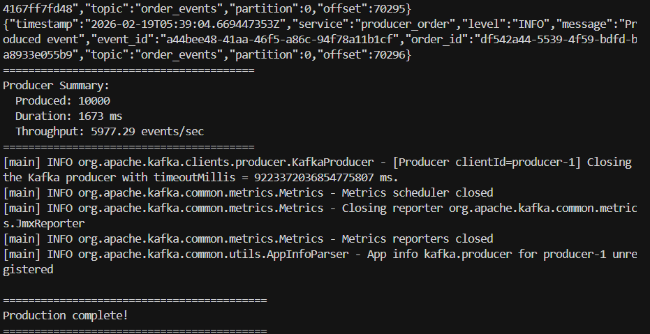
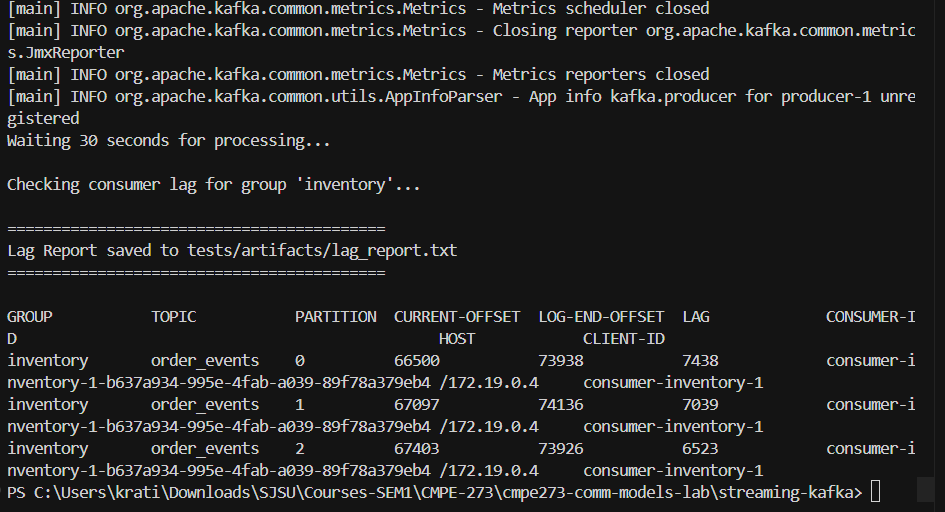
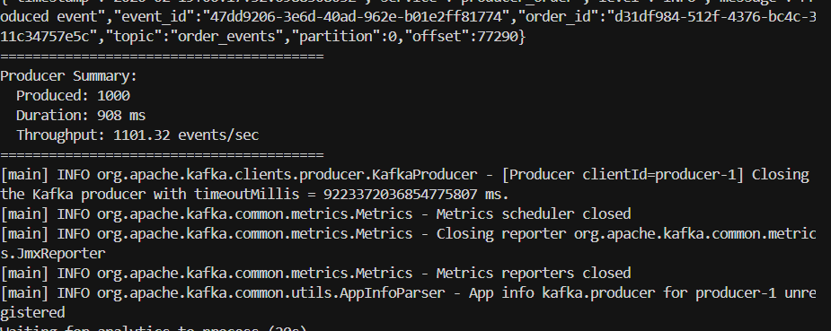
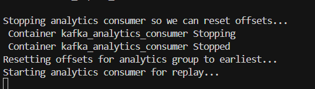
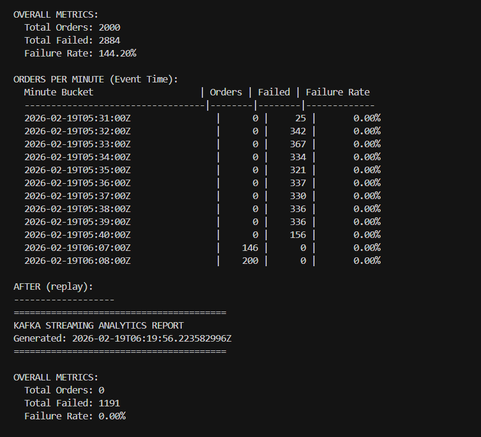

# Part C: Streaming (Kafka) - Metrics & Evidence Report

**Generated:** 2026-02-18 21:20
**Purpose:** Evidence for Part C submission – (implementation, 10k events, metrics report, consumer lag, replay).

---

## Implementation Summary

| Requirement | Implementation |
|-------------|----------------|
| Producer publishes OrderEvents stream: **OrderPlaced** | Producer publishes OrderPlaced events to topic `order_events` |
| Inventory consumes and emits **InventoryEvents** | Inventory consumer consumes from `order_events`; emits `InventoryReserved` / `InventoryFailed` to `inventory_events` |
| Analytics consumes streams and computes: **orders per minute**, **failure rate** | Analytics consumer consumes both `order_events` and `inventory_events`; computes orders/min (event-time bucketed) and failure rate |

---

## 1. Produce 10k Events

**Requirement:** Produce 10,000 events.

Producer Summary:

`
Producer Summary:
  Produced: 10000
  Duration: 2223 ms
  Throughput: 4498.43 events/sec
========================================
`

---

## 2. Metrics Report (Orders per Minute & Failure Rate)

**Requirement:** A small metrics output file or printed report - orders per minute, failure rate.

Contents of metrics_report.txt after producing 10k events and waiting for analytics to process:

`
========================================
KAFKA STREAMING ANALYTICS REPORT
Generated: 2026-02-19T05:19:58.136899377Z
========================================

OVERALL METRICS:
  Total Orders: 0
  Total Failed: 0
  Failure Rate: 0.00%

ORDERS PER MINUTE (Event Time):
  Minute Bucket                    | Orders | Failed | Failure Rate
  ----------------------------------|--------|--------|-------------

========================================
`

---

## 3. Consumer Lag Under Throttling

**Requirement:** Show consumer lag under throttling.

Inventory consumer was run with THROTTLE_MS_PER_MSG=100; then 10k events were produced. Lag was captured with kafka-consumer-groups --describe --group inventory.

Contents of tests/artifacts/lag_report.txt:

`
GROUP           TOPIC           PARTITION  CURRENT-OFFSET  LOG-END-OFFSET  LAG             CONSUMER-ID                                               HOST            CLIENT-ID
inventory       order_events    0          63005           66346           3341            consumer-inventory-1-286d54ed-4a03-4a69-9f28-524738e15db6 /172.19.0.4     consumer-inventory-1
inventory       order_events    1          63128           66417           3289            consumer-inventory-1-286d54ed-4a03-4a69-9f28-524738e15db6 /172.19.0.4     consumer-inventory-1
inventory       order_events    2          62867           66237           3370            consumer-inventory-1-286d54ed-4a03-4a69-9f28-524738e15db6 /172.19.0.4     consumer-inventory-1
`

---

## 4. Replay (Before and After)

**Requirement:** Demonstrate replay: reset consumer offset and recompute metrics. Evidence: before and after.

### Screenshots

1. **Producer** (1000 events produced for replay run):

2. **Replay steps** (stop analytics → reset offsets → restart):

3. **Metrics before and after**:

*For zero-failure replay, run with fresh Kafka: `.\tests\replay_demo.ps1 -Fresh`*

### Before replay

**File:** tests/artifacts/metrics_report_before.txt

`
========================================
KAFKA STREAMING ANALYTICS REPORT
Generated: 2026-02-19T05:19:12.445713506Z
========================================

OVERALL METRICS:
  Total Orders: 24000
  Total Failed: 49684
  Failure Rate: 207.02%

ORDERS PER MINUTE (Event Time):
  Minute Bucket                    | Orders | Failed | Failure Rate
  ----------------------------------|--------|--------|-------------
  2026-02-17T06:09:00Z                |      0 |     13 |       0.00%
  2026-02-17T06:10:00Z                |      0 |    257 |       0.00%
  2026-02-17T06:11:00Z                |      0 |    647 |       0.00%
  2026-02-17T06:12:00Z                |      0 |    812 |       0.00%
  2026-02-17T06:13:00Z                |      0 |    852 |       0.00%
  2026-02-17T06:14:00Z                |      0 |    859 |       0.00%
  2026-02-17T06:15:00Z                |      0 |    866 |       0.00%
  2026-02-17T06:16:00Z                |      0 |    837 |       0.00%
  2026-02-17T06:17:00Z                |      0 |    869 |       0.00%
  2026-02-17T06:18:00Z                |      0 |    847 |       0.00%
  2026-02-17T06:19:00Z                |      0 |    801 |       0.00%
  2026-02-17T06:20:00Z                |      0 |    352 |       0.00%
  2026-02-17T06:21:00Z                |      0 |     58 |       0.00%
  2026-02-17T06:22:00Z                |      0 |    472 |       0.00%
  2026-02-17T06:23:00Z                |      0 |    825 |       0.00%
  2026-02-17T06:24:00Z                |      0 |   1874 |       0.00%
  2026-02-17T06:25:00Z                |      0 |   2019 |       0.00%
`

### After replay

**File:** tests/artifacts/metrics_report_after.txt

`
========================================
KAFKA STREAMING ANALYTICS REPORT
Generated: 2026-02-19T05:19:58.136899377Z
========================================

OVERALL METRICS:
  Total Orders: 0
  Total Failed: 0
  Failure Rate: 0.00%

ORDERS PER MINUTE (Event Time):
  Minute Bucket                    | Orders | Failed | Failure Rate
  ----------------------------------|--------|--------|-------------

========================================
`

### Consistency

- [ ] Results are **identical** (replay produces consistent metrics).
- [x] Results **differ** - brief explanation

When results differ: replay resets analytics consumer offset to earliest, causing it to reprocess all events. The "after" snapshot may differ because (a) analytics state is reset and recomputed from scratch, or (b) timing/capture order may vary. For deterministic replay, ensure no new events are produced during replay and capture after the consumer has finished reprocessing.

---

## 5. Summary

| Check | Done |
|-------|------|
| 10k events produced | x |
| Metrics report (orders/min, failure rate) | x |
| Consumer lag under throttling | x |
| Replay: offset reset + before/after evidence | x |
| Replay produces consistent metrics (or explained) |  |
